# MapMyRoute: AI-Crafted Journeys to Success

<!-- (Placeholder: Replace with actual image URL if available) -->
<!-- (Placeholder: Replace with actual image URL if available) -->

MapMyRoute is a next-generation AI-powered platform that creates personalized, outcome-driven learning roadmaps. It's designed to help users achieve their learning goals by providing tailored plans, curating resources, tracking progress, and adapting dynamically to individual needs.

## Table of Contents

- [Project Title and Description](#project-title-and-description)
- [Team Members](#team-members)
- [Features Implemented](#features-implemented)
- [Technology Stack and Architecture](#technology-stack-and-architecture)
- [App Flow / System Architecture Diagram](#app-flow--system-architecture-diagram)
- [Role of AI in Development / AI Tools Used](#role-of-ai-in-development--ai-tools-used)
- [Screenshots of the User Interface](#screenshots-of-the-user-interface)
- [Setup and Installation Instructions](#setup-and-installation-instructions)
- [Link to Deployed Application](#link-to-deployed-application)
- [Future Roadmap or Improvements](#future-roadmap-or-improvements)

## Project Title and Description

**MapMyRoute: AI-Crafted Journeys to Success**

In today's digital learning landscape, individuals often face an overload of content without a clear path to follow. MapMyRoute addresses this by providing a personalized, adaptive, and goal-driven learning experience. The platform breaks down learning into weekly action plans, curates the best free and paid resources, and tracks progress with an interactive planner. Whether users aim to get job-ready, build a portfolio, or master a new skill, MapMyRoute adapts dynamically to keep them motivated and on track.

## Team Members

This project was developed by team **SheCodesAI**:

- **Diksha Patkar** (D12C, 42)
- **Sakshi Thorat** (D12B, 55)

## Features Implemented

MapMyRoute offers a comprehensive set of features to facilitate personalized learning:

- **AI-Powered Learning Roadmaps**: Generates personalized plans based on user goals, skill level, and time availability.
- **Weekly Goal Breakdown**: Provides clear, structured weekly learning plans with practical tasks.
- **Curated Resource Recommendations**: Recommends relevant free and paid resources from platforms like YouTube and Coursera, ranked by quality.
- **Interactive Progress Tracker & Planner**: Includes task checklists, a calendar view, rescheduling options, and completion tracking.
- **Adaptive Roadmap Updates**: Automatically adjusts the learning path based on missed tasks or updated time availability, with smart catch-up suggestions.
- **User Account & Dashboard**: Allows users to track progress, time spent, and save all skill plans in a personalized dashboard.
- **AI Skill Coach Chatbot**: A personal learning assistant to answer doubts, simplify concepts, and offer suggestions.
- **Real-World Skill Mapping & Job Integration**: Aligns learned skills with live job roles, job feeds, and industry demands.
- **Micro Skill Challenges & Quizzes**: Provides weekly interactive challenges to reinforce learning.
- **Outcome-Driven Learning Modes**: Users can choose specific goals like "Get Job-Ready" or "Build a Portfolio," and the roadmap adjusts accordingly.
- **Platform-Agnostic Resource Hub**: Offers AI-curated, user-rated resources (videos, articles, courses, books) for every topic from across the web.
- **Progress Celebration**: Provides instant cheers and notifications upon task completion.
- **Download Roadmap**: Ability to download the generated roadmap as a PDF or CSV.

## Technology Stack and Architecture

MapMyRoute utilizes a robust technology stack to deliver its features:

**Frontend:**
- React (JavaScript, JSX)
- Vite
- BootStrap

**Backend:**
- Python
- FastAPI
- PostgreSQL Database

**Authentication:**
- Firebase Authentication
- JWT

**Other Integrations:**
- Landbot (for chatbot integration)
- Adzuna API (for job feeds)
- GROQ API (for AI model execution/LLM)

## App Flow / System Architecture Diagram

The system architecture of MapMyRoute involves several interconnected components:

### App Flow
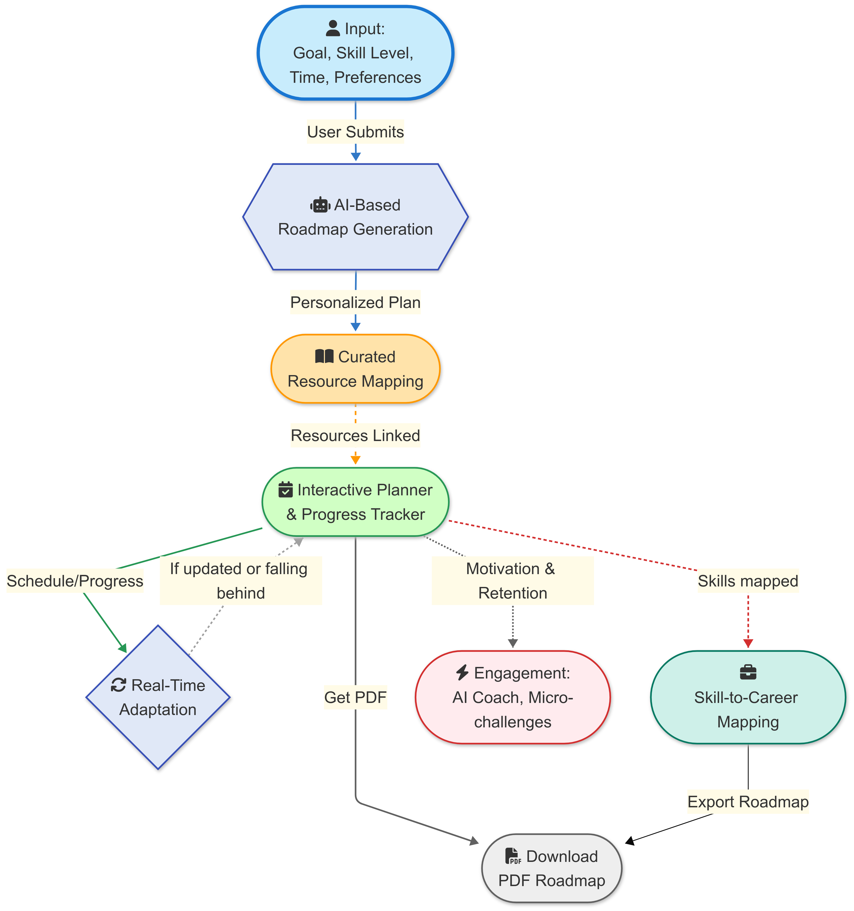

- **User Input**: Users provide their goal, skill level, time, and preferences.
- **AI-Based Roadmap Generation**: An AI module processes user input to create a personalized, weekly learning roadmap.
- **Curated Resource Mapping**: Resources are linked to the personalized plan.
- **Interactive Planner & Progress Tracker**: Manages schedule and tracks progress.
- **Real-Time Adaptation**: The roadmap dynamically adjusts if the user updates their schedule or falls behind.
- **Engagement**: Features like an AI Coach and micro-challenges keep users motivated and engaged.
- **Skill-to-Career Mapping**: Learned skills are mapped to real-world job roles.
- **Download PDF Roadmap**: Users can download their personalized roadmap.
- **Export Roadmap**: Option to export the roadmap.

<!-- (Placeholder: Replace with actual image URL if available from the document) -->

## Role of AI in Development / AI Tools Used

AI played a crucial role throughout the development of MapMyRoute:


- **ChatGPT**: Used for generating roadmap logic, refining content, and building intelligent chatbot responses.
- **Groq AI**: Leveraged for ultra-fast AI model execution during testing and model benchmarking.
- **Cursor AI**: Assisted in writing, debugging, and improving code directly within the development environment.
- **GitHub Copilot**: Helped with real-time code suggestions and boilerplate generation in both frontend and backend.
- **Figma AI Plugins**: Used to accelerate UI/UX design with smart layout suggestions and design automation.
- **Canva AI**: Used for creating presentation graphics, icons, and the MapMyRoute Logo.
- **Notion AI**: Assisted in organizing project documentation, generating task plans, and summarizing notes.
- **Perplexity AI**: Used as a research assistant to gather insights, compare tools, and explore trends.

## Screenshots of the User Interface

Here are some screenshots of the MapMyRoute user interface:

### Home Page
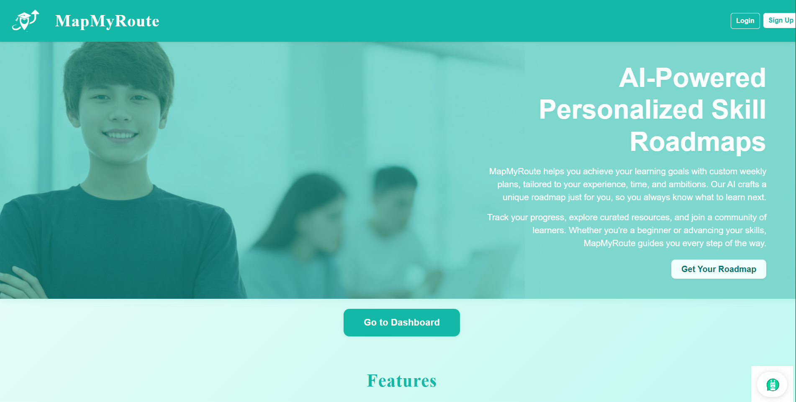

### AI Roadmap Generator
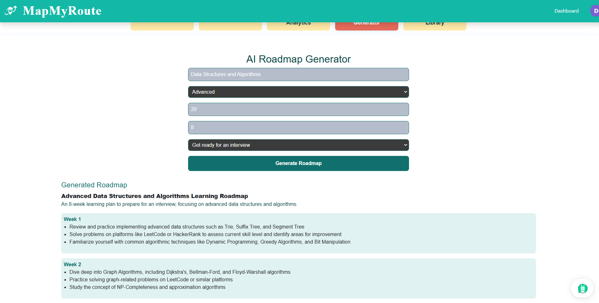

### My Skill Paths
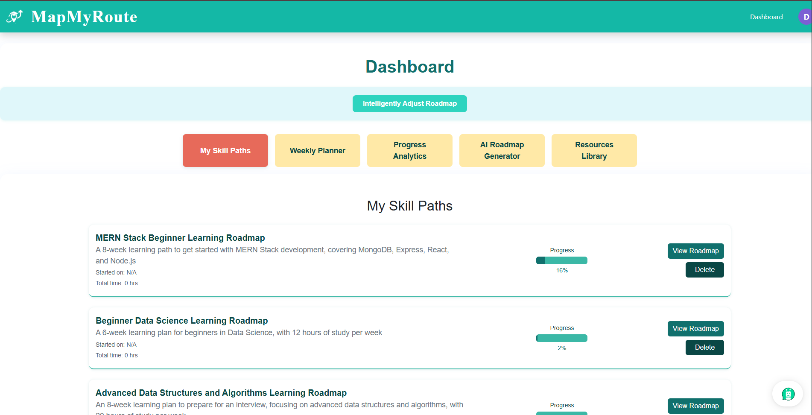

### Weekly Planner
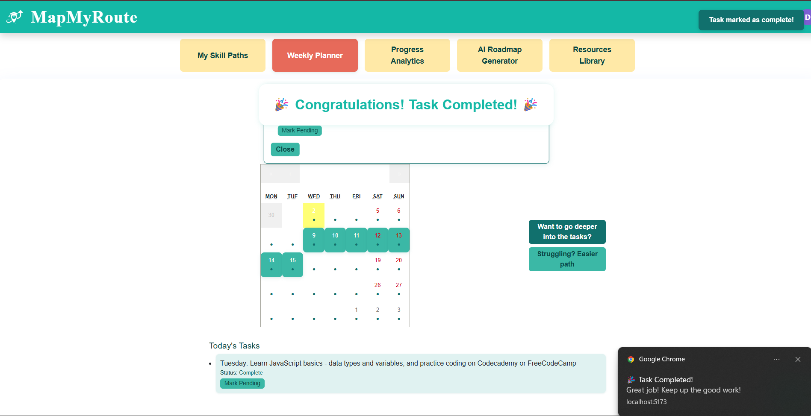

### Progress Analytics
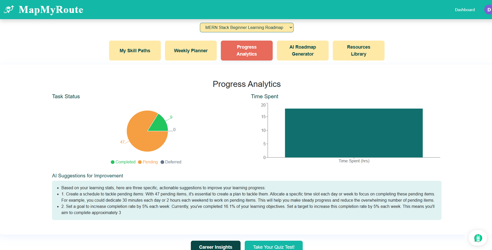

### Resources Library
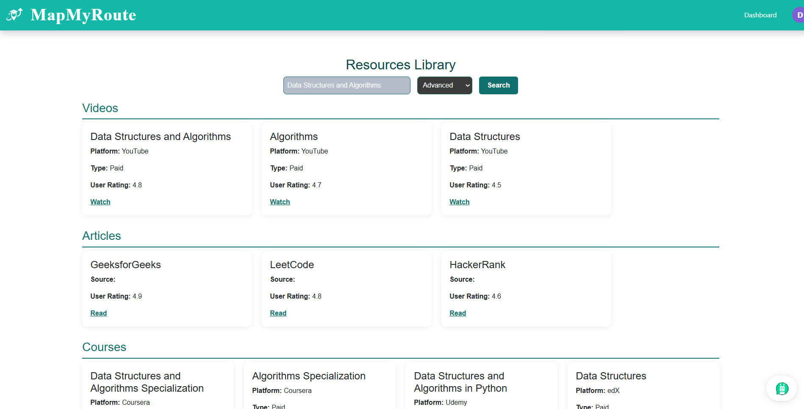

### Career Insights
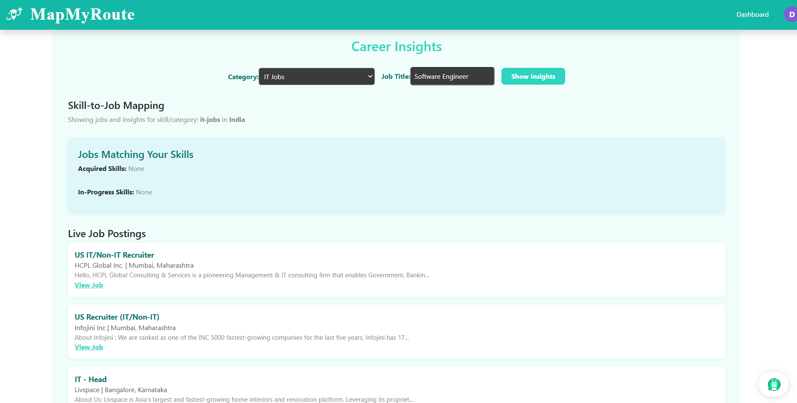

### Quizzes
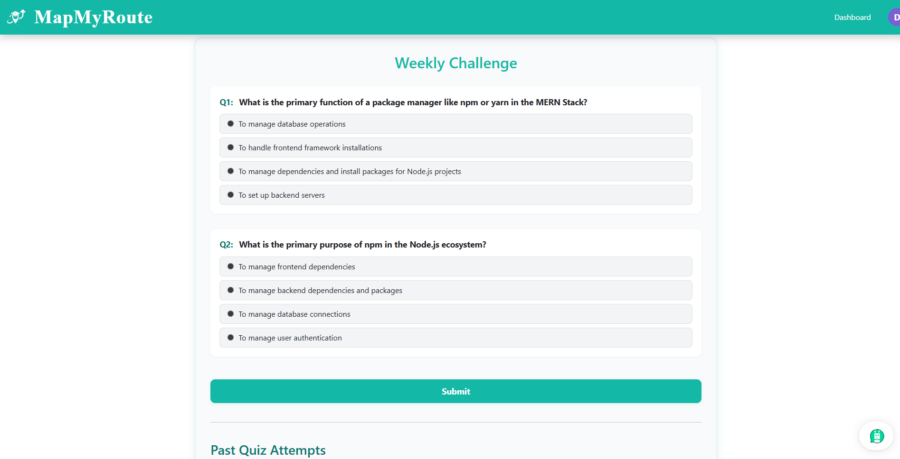

### AI Skill Chatbot
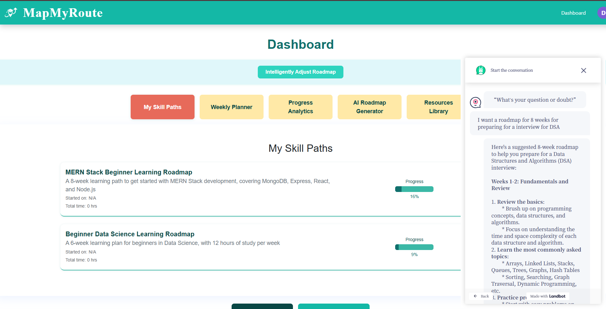

### Profile
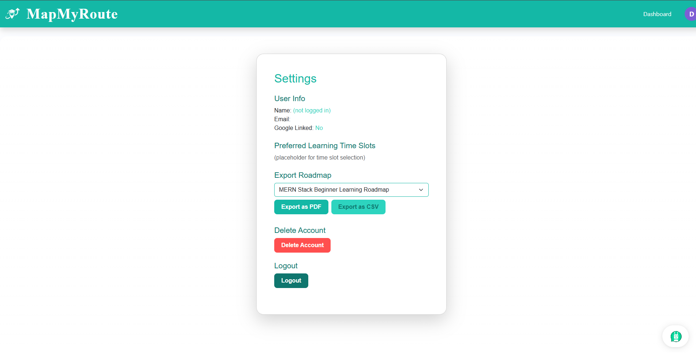

## Setup and Installation Instructions

To set up and run MapMyRoute locally, follow these steps:

1. **Clone the repository:**
    ```bash
    git clone <repository_url>
    cd MapMyRoute
    ```
2. **Frontend Setup (React with Vite):**
    ```bash
    cd frontend
    npm install
    npm run dev
    ```
    (Adjust commands based on your actual project structure and package manager.)
3. **Backend Setup (FastAPI with Python):**
    ```bash
    cd backend
    pip install -r requirements.txt
    uvicorn main:app --reload
    ```
    (Adjust commands based on your actual project structure. Ensure you have Python and pip installed.)
4. **Database Configuration (PostgreSQL):**
    - Ensure PostgreSQL is installed and running.
    - Create a database for MapMyRoute.
    - Update the database connection string in your backend configuration (e.g., in a `.env` file).
5. **Environment Variables (.env File Structure):**
    - You will need to create `.env` files for the backend to securely store your API keys and configuration values.

    **Create a .env file in backend folder(.env):**
    ```
    # Database
    DATABASE_URL=postgresql://<username>:<password>@localhost:5432/<database_name>

    # Adzuna API
    ADZUNA_APP_ID=your_adzuna_app_id
    ADZUNA_APP_KEY=your_adzuna_app_key

    # Groq API
    GROQ_API_KEY=your_groq_api_key
    ```
    Be sure to add your `.env` files to `.gitignore` to keep your secrets safe!

    **Create a .env file in frontend folder (frontend/.env):**
    ```
    VITE_API_URL=https://mapmyroute.onrender.com
    ```
    In your React code, access it with:
    ```js
    const apiUrl = import.meta.env.VITE_API_URL;
    ```
    **Note:** After changing the `.env` file, restart your dev server (`npm run dev`).
6. **Firebase Authentication Setup:**
    - Create a Firebase project and enable Authentication.
    - Configure your Firebase credentials in your frontend application in firebase.js file.
    - **Important:** Add your deployed frontend domain (e.g., `your-app.vercel.app`) to the list of authorized domains in the Firebase Console under Authentication → Sign-in method. This is required for Google login to work in production.

## Link to Deployed Application

https://map-my-route.vercel.app/

## Future Roadmap or Improvements

The team has outlined several exciting future enhancements for MapMyRoute:

- **Gamification**:
    - Add badges, leaderboards, and rewards to increase user engagement and motivation.
- **Community Features**:
    - Implement forums, peer-to-peer mentoring, or group challenges to foster a learning community.
- **Localization and Accessibility**:
    - Support multiple languages and ensure the platform is accessible to users with disabilities.
- **Mobile Application**:
    - Develop native or cross-platform mobile apps for iOS and Android to reach a wider audience.
- **Voice Assistant Integration**:
    - Add support for voice-based queries and navigation using AI assistants (Google Assistant, Alexa, etc.).
- **API Expansion**:
    - Provide public APIs for third-party integrations, allowing other developers to build on top of the platform.

